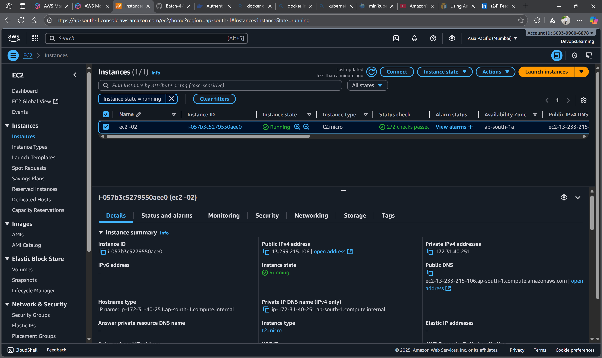

# Day 7: Amazon EBS (Elastic Block Store) Volumes

## 📚 Learning Objectives
- Understand EBS Volume concepts and types
- Learn EBS Volume lifecycle management
- Practice creating, attaching, and detaching EBS volumes
- Demonstrate data persistence across EC2 instance termination

## 🎯 What is Amazon EBS?

Amazon Elastic Block Store (EBS) provides persistent block storage volumes for use with Amazon EC2 instances. EBS volumes are network-attached storage that persist independently from the life of an EC2 instance.

### Key Features:
- **Persistent Storage**: Data persists beyond EC2 instance lifecycle
- **High Availability**: Built-in redundancy within Availability Zone
- **Scalable**: Modify volume size and performance on-the-fly
- **Backup Support**: Point-in-time snapshots to Amazon S3

## 📊 EBS Volume Types

| Volume Type | Use Case | IOPS | Throughput |
|-------------|----------|------|------------|
| **gp3** | General purpose SSD | 3,000-16,000 | 125-1,000 MiB/s |
| **gp2** | General purpose SSD | 100-16,000 | Up to 250 MiB/s |
| **io2** | High IOPS SSD | Up to 64,000 | Up to 1,000 MiB/s |
| **st1** | Throughput optimized HDD | 500 | Up to 500 MiB/s |
| **sc1** | Cold HDD | 250 | Up to 250 MiB/s |

## 🛠️ Practical Lab: EBS Volume Management

### Prerequisites
- AWS Account with EC2 access
- Basic understanding of Linux commands
- SSH client (PuTTY/Terminal)

### Lab Overview
1. Create an EBS volume
2. Launch EC2 instance
3. Attach EBS volume to EC2
4. Format and mount the volume
5. Create test data
6. Terminate EC2 instance
7. Launch new EC2 instance
8. Attach same EBS volume
9. Verify data persistence

---

## 🚀 Step-by-Step Implementation

### Step 1: Create EBS Volume

1. **Navigate to EC2 Dashboard**
   - Go to AWS Console → EC2 → Volumes

2. **Create Volume**
   ```
   Volume Type: gp3
   Size: 10 GiB
   Availability Zone: us-east-1a (match your EC2 AZ)
   Encryption: Disabled (for simplicity)
   ```

3. **Add Tags**
   ```
   Key: Name
   Value: MyDataVolume
   ```

### Step 2: Launch EC2 Instance

```bash
# Instance Configuration
AMI: Amazon Linux 2
Instance Type: t2.micro
Key Pair: your-key-pair
Security Group: Allow SSH (port 22)
Availability Zone: us-east-1a (same as EBS volume)
```

### Step 3: Attach EBS Volume

1. **Select Volume** → Actions → Attach Volume
2. **Instance**: Select your EC2 instance
3. **Device**: /dev/sdf (or /dev/xvdf)

### Step 4: Connect to EC2 and Configure Volume

```bash
# Connect via SSH
ssh -i your-key.pem ec2-user@your-ec2-ip

# Check available disks
lsblk

# Expected output:
# NAME    MAJ:MIN RM SIZE RO TYPE MOUNTPOINT
# xvda    202:0    0   8G  0 disk 
# └─xvda1 202:1    0   8G  0 part /
# xvdf    202:80   0  10G  0 disk 

# Check if volume has filesystem
sudo file -s /dev/xvdf

# If output shows "data", volume is empty and needs formatting
```

### Step 5: Format and Mount Volume

```bash
# Create filesystem (ext4)
sudo mkfs -t ext4 /dev/xvdf

# Create mount point
sudo mkdir /mnt/my-ebs-vol

# Mount the volume
sudo mount /dev/xvdf /mnt/my-ebs-vol

# Verify mount
df -h

# Change ownership (optional)
sudo chown ec2-user:ec2-user /mnt/my-ebs-vol
```

### Step 6: Create Test Data

```bash
# Create test files
echo "This is persistent data from Day 7 lab" > /mnt/my-ebs-vol/test-file.txt
echo "EBS Volume Demo - $(date)" > /mnt/my-ebs-vol/timestamp.txt

# Create directory with multiple files
mkdir /data/demo-folder
for i in {1..5}; do
    echo "File $i content - Created on $(date)" > /data/demo-folder/file$i.txt
done

# Verify data
ls -la /data/
cat /data/test-file.txt
cat /data/timestamp.txt
ls -la /data/demo-folder/
```

### Step 7: Unmount and Detach Volume

```bash
# Unmount volume (important before detaching)
sudo umount /data

# Verify unmount
df -h
```

**In AWS Console:**
1. Select Volume → Actions → Detach Volume
2. Terminate EC2 Instance

### Step 8: Launch New EC2 Instance

```bash
# Launch new instance with same configuration
AMI: Amazon Linux 2
Instance Type: t2.micro
Availability Zone: us-east-1a (same as EBS volume)
Key Pair: your-key-pair
```

### Step 9: Attach Volume to New Instance

1. **Attach Volume** to new EC2 instance
2. **Device**: /dev/sdf

### Step 10: Mount and Verify Data Persistence

```bash
# Connect to new instance
ssh -i your-key.pem ec2-user@new-ec2-ip

# Check available disks
lsblk

# Check filesystem (should show ext4 now)
sudo file -s /dev/xvdf

# Create mount point
sudo mkdir /data

# Mount volume (no formatting needed!)
sudo mount /dev/xvdf /data

# Verify persistent data
ls -la /data/
cat /data/test-file.txt
cat /data/timestamp.txt
ls -la /data/demo-folder/
```

## ✅ Expected Results

You should see:
- All files created in previous instance
- Original timestamps preserved
- Directory structure intact
- Data completely persistent across instance termination

## 🔧 Auto-Mount Configuration (Optional)

To automatically mount volume on boot:

```bash
# Get UUID of volume
sudo blkid /dev/xvdf

# Edit fstab
sudo nano /etc/fstab

# Add line (replace UUID with actual value):
UUID=your-uuid-here /data ext4 defaults,nofail 0 2

# Test fstab
sudo mount -a
```

## 📝 Key Commands Summary

```bash
# Volume Management
lsblk                          # List block devices
sudo file -s /dev/xvdf         # Check filesystem
sudo mkfs -t ext4 /dev/xvdf    # Format volume
sudo mount /dev/xvdf /mnt/my-ebs-vol     # Mount volume
sudo umount /data              # Unmount volume
df -h                          # Show mounted filesystems

# Data Operations
echo "content" > /data/file.txt    # Create file
ls -la /data/                      # List directory
cat /data/file.txt                 # Read file content
```

## 🎯 Lab Verification Checklist

- [ ] EBS volume created successfully
- [ ] Volume attached to first EC2 instance
- [ ] Volume formatted with ext4 filesystem
- [ ] Test data created and verified
- [ ] Volume detached from first instance
- [ ] First EC2 instance terminated
- [ ] New EC2 instance launched
- [ ] Same volume attached to new instance
- [ ] Data persistence verified (all files intact)
- [ ] Timestamps match original creation time

## 🚨 Important Notes

1. **Availability Zone**: EBS volumes can only attach to instances in the same AZ
2. **Unmount First**: Always unmount before detaching to prevent data corruption
3. **Formatting**: Only format new volumes, existing volumes retain data
4. **Backup**: Use EBS snapshots for backup and disaster recovery
5. **Cost**: EBS volumes incur charges even when detached

## 🔍 Troubleshooting

**Volume not visible:**
```bash
# Refresh partition table
sudo partprobe
```

**Mount fails:**
```bash
# Check for errors
dmesg | tail
sudo fsck /dev/xvdf
```

**Permission denied:**
```bash
sudo chown ec2-user:ec2-user /data
```
### Screenshot



## 🎤 Interview Questions & Answers

### Fresher Level Questions

**Q1: What is Amazon EBS?**
**A:** Amazon Elastic Block Store (EBS) provides persistent block storage volumes for EC2 instances. Data persists independently from the instance lifecycle.

**Q2: What are the different EBS volume types?**
**A:** 
- **gp3/gp2**: General Purpose SSD for balanced price/performance
- **io2/io1**: Provisioned IOPS SSD for high-performance workloads
- **st1**: Throughput Optimized HDD for big data workloads
- **sc1**: Cold HDD for infrequent access

**Q3: Can you attach one EBS volume to multiple EC2 instances?**
**A:** No, standard EBS volumes can only be attached to one EC2 instance at a time. However, EBS Multi-Attach (available for io1/io2) allows attachment to multiple instances.

**Q4: What happens to EBS volumes when an EC2 instance is terminated?**
**A:** Root EBS volumes are deleted by default, but additional EBS volumes persist unless specifically configured to delete on termination.

**Q5: Do EBS volumes need to be in the same Availability Zone as EC2 instances?**
**A:** Yes, EBS volumes can only be attached to EC2 instances in the same Availability Zone.

### Intermediate Level Questions

**Q6: Explain the difference between EBS and Instance Store.**
**A:** 
- **EBS**: Network-attached, persistent, can be detached/reattached, survives instance termination
- **Instance Store**: Physically attached, temporary, high performance, data lost on stop/termination

**Q7: How do you ensure data persistence across EC2 instance lifecycle?**
**A:** 
- Use EBS volumes for persistent storage
- Properly unmount volumes before detaching
- Create regular EBS snapshots for backup
- Configure volumes to not delete on termination

**Q8: What are EBS Snapshots and how do they work?**
**A:** EBS Snapshots are point-in-time backups stored in S3. They are incremental - only changed blocks are saved after the first snapshot, reducing storage costs.

**Q9: How do you migrate an EBS volume to a different Availability Zone?**
**A:** 
1. Create a snapshot of the EBS volume
2. Create a new volume from the snapshot in the target AZ
3. Attach the new volume to an instance in the target AZ

**Q10: What is EBS encryption and when should you use it?**
**A:** EBS encryption provides data-at-rest and data-in-transit encryption using AWS KMS keys. Use it for:
- Sensitive data compliance requirements
- Regulatory compliance (HIPAA, PCI DSS)
- Enhanced security posture

## 📚 Additional Resources

- [AWS EBS Documentation](https://docs.aws.amazon.com/ebs/)
- [EBS Volume Types](https://docs.aws.amazon.com/AWSEC2/latest/UserGuide/ebs-volume-types.html)
- [EBS Snapshots](https://docs.aws.amazon.com/AWSEC2/latest/UserGuide/EBSSnapshots.html)

---

**Lab Duration:** 60-80 minutes  
**Difficulty:** Intermediate  
**Cost:** ~$0.10 for 1 hour (10GB gp3 volume)

## 🎯 Key Takeaways

1. **EBS Volumes** provide persistent block storage for EC2
2. **Data Persistence** survives instance termination
3. **Volume Types** should match performance requirements
4. **Same AZ Requirement** for volume-instance attachment
5. **Proper Unmounting** prevents data corruption
6. **Snapshots** enable backup and disaster recovery

## 🎉 Congratulations!

You've successfully demonstrated EBS volume persistence across EC2 instance lifecycle. This is a fundamental concept for stateful applications and data storage in AWS.

**Next Steps:** Day 8 - EBS Snapshots and Backup Strategies