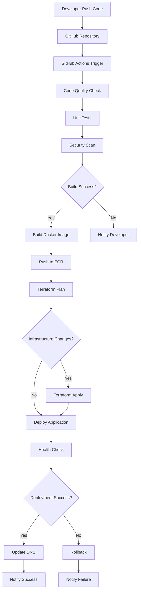
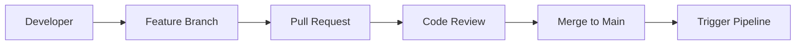
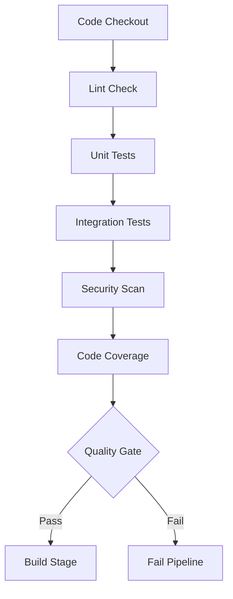
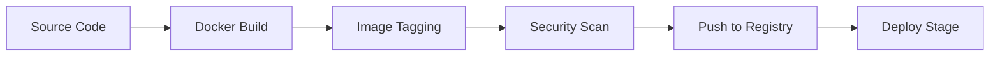
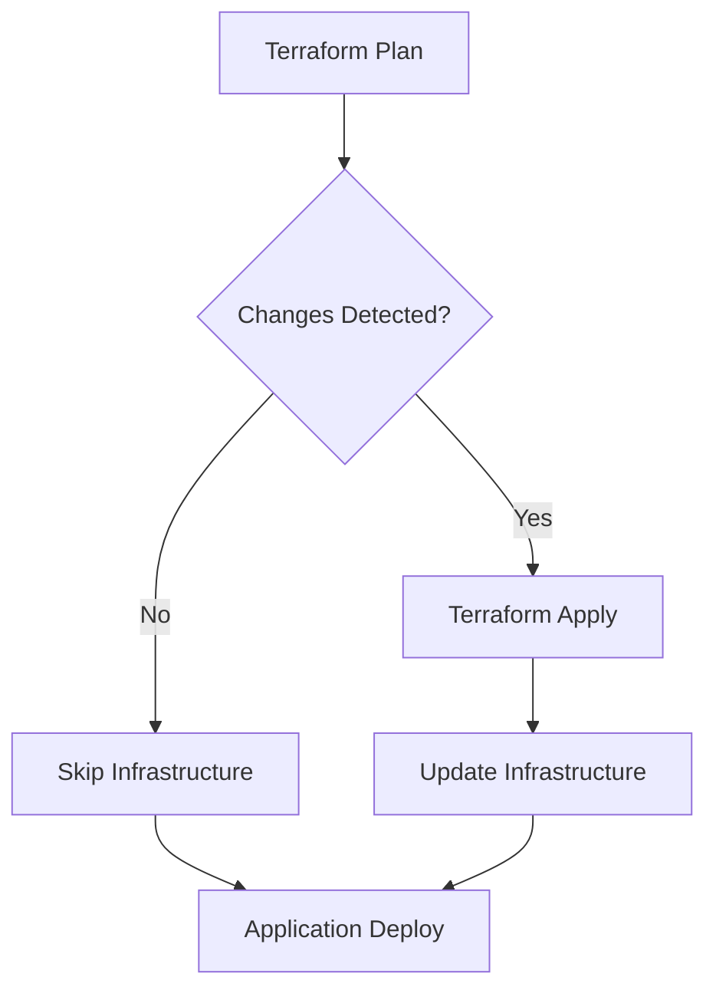
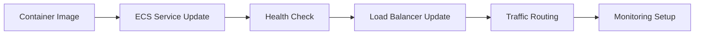
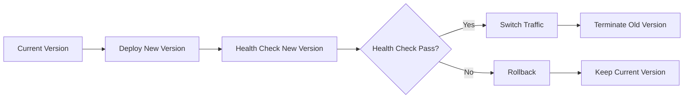
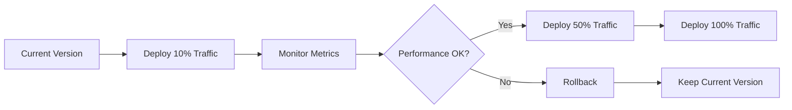

# CI/CD Pipeline Flow Architecture

## 🔄 Complete CI/CD Pipeline Overview



## 🏗️ Detailed Pipeline Stages

### **Stage 1: Source Code Management**


### **Stage 2: Code Quality & Testing**


### **Stage 3: Build & Package**


### **Stage 4: Infrastructure Deployment**


### **Stage 5: Application Deployment**


## 🛠️ AWS Service Integration

### **GitHub Actions Workflow**
```yaml
name: CI/CD Pipeline
on:
  push:
    branches: [main]
  pull_request:
    branches: [main]

jobs:
  test:
    runs-on: ubuntu-latest
    steps:
      - uses: actions/checkout@v2
      - name: Setup Node.js
        uses: actions/setup-node@v2
        with:
          node-version: '16'
      - name: Install dependencies
        run: npm ci
      - name: Run tests
        run: npm test
      - name: Run security scan
        run: npm audit

  build:
    needs: test
    runs-on: ubuntu-latest
    steps:
      - uses: actions/checkout@v2
      - name: Configure AWS credentials
        uses: aws-actions/configure-aws-credentials@v1
        with:
          aws-access-key-id: ${{ secrets.AWS_ACCESS_KEY_ID }}
          aws-secret-access-key: ${{ secrets.AWS_SECRET_ACCESS_KEY }}
          aws-region: us-east-1
      - name: Login to Amazon ECR
        id: login-ecr
        uses: aws-actions/amazon-ecr-login@v1
      - name: Build and push Docker image
        env:
          ECR_REGISTRY: ${{ steps.login-ecr.outputs.registry }}
          ECR_REPOSITORY: myapp
          IMAGE_TAG: ${{ github.sha }}
        run: |
          docker build -t $ECR_REGISTRY/$ECR_REPOSITORY:$IMAGE_TAG .
          docker push $ECR_REGISTRY/$ECR_REPOSITORY:$IMAGE_TAG

  deploy:
    needs: build
    runs-on: ubuntu-latest
    steps:
      - uses: actions/checkout@v2
      - name: Configure AWS credentials
        uses: aws-actions/configure-aws-credentials@v1
      - name: Setup Terraform
        uses: hashicorp/setup-terraform@v1
      - name: Terraform Init
        run: terraform init
      - name: Terraform Plan
        run: terraform plan -out=tfplan
      - name: Terraform Apply
        run: terraform apply tfplan
      - name: Update ECS Service
        run: |
          aws ecs update-service \
            --cluster my-cluster \
            --service my-service \
            --force-new-deployment
```

## 🔧 Infrastructure as Code (Terraform)

### **Main Infrastructure Configuration**
```hcl
# main.tf
terraform {
  required_version = ">= 1.0"
  backend "s3" {
    bucket = "my-terraform-state"
    key    = "prod/terraform.tfstate"
    region = "us-east-1"
  }
}

provider "aws" {
  region = var.aws_region
}

# VPC Configuration
module "vpc" {
  source = "./modules/vpc"
  environment = var.environment
  vpc_cidr = var.vpc_cidr
}

# ECS Cluster
resource "aws_ecs_cluster" "main" {
  name = "${var.project_name}-${var.environment}"
  
  setting {
    name  = "containerInsights"
    value = "enabled"
  }
}

# ECS Service
resource "aws_ecs_service" "app" {
  name            = "${var.project_name}-service"
  cluster         = aws_ecs_cluster.main.id
  task_definition = aws_ecs_task_definition.app.arn
  desired_count   = var.app_count
  launch_type     = "FARGATE"

  network_configuration {
    security_groups  = [aws_security_group.ecs_tasks.id]
    subnets          = module.vpc.private_subnets
    assign_public_ip = false
  }

  load_balancer {
    target_group_arn = aws_lb_target_group.app.arn
    container_name   = "app"
    container_port   = var.app_port
  }

  depends_on = [aws_lb_listener.front_end]
}

# Application Load Balancer
resource "aws_lb" "main" {
  name               = "${var.project_name}-alb"
  internal           = false
  load_balancer_type = "application"
  security_groups    = [aws_security_group.lb.id]
  subnets            = module.vpc.public_subnets
}

# Target Group
resource "aws_lb_target_group" "app" {
  name        = "${var.project_name}-tg"
  port        = var.app_port
  protocol    = "HTTP"
  vpc_id      = module.vpc.vpc_id
  target_type = "ip"

  health_check {
    healthy_threshold   = "3"
    interval           = "30"
    protocol           = "HTTP"
    matcher            = "200"
    timeout            = "3"
    path               = var.health_check_path
    unhealthy_threshold = "2"
  }
}
```

## 📊 Monitoring & Observability

### **CloudWatch Dashboard Configuration**
```json
{
  "widgets": [
    {
      "type": "metric",
      "x": 0,
      "y": 0,
      "width": 12,
      "height": 6,
      "properties": {
        "metrics": [
          ["AWS/ECS", "CPUUtilization", "ServiceName", "my-service", "ClusterName", "my-cluster"],
          [".", "MemoryUtilization", ".", ".", ".", "."]
        ],
        "view": "timeSeries",
        "stacked": false,
        "region": "us-east-1",
        "title": "ECS Service Metrics"
      }
    },
    {
      "type": "metric",
      "x": 12,
      "y": 0,
      "width": 12,
      "height": 6,
      "properties": {
        "metrics": [
          ["AWS/ApplicationELB", "TargetResponseTime", "LoadBalancer", "my-alb"],
          [".", "RequestCount", ".", "."]
        ],
        "view": "timeSeries",
        "stacked": false,
        "region": "us-east-1",
        "title": "Load Balancer Metrics"
      }
    }
  ]
}
```

## 🔒 Security Implementation

### **IAM Roles and Policies**
```hcl
# IAM Role for ECS Tasks
resource "aws_iam_role" "ecs_task_execution_role" {
  name = "${var.project_name}-ecs-task-execution-role"

  assume_role_policy = jsonencode({
    Version = "2012-10-17"
    Statement = [
      {
        Action = "sts:AssumeRole"
        Effect = "Allow"
        Principal = {
          Service = "ecs-tasks.amazonaws.com"
        }
      }
    ]
  })
}

resource "aws_iam_role_policy_attachment" "ecs_task_execution_role_policy" {
  role       = aws_iam_role.ecs_task_execution_role.name
  policy_arn = "arn:aws:iam::aws:policy/service-role/AmazonECSTaskExecutionRolePolicy"
}

# Security Groups
resource "aws_security_group" "lb" {
  name        = "${var.project_name}-lb-sg"
  description = "Security group for load balancer"
  vpc_id      = module.vpc.vpc_id

  ingress {
    protocol    = "tcp"
    from_port   = 80
    to_port     = 80
    cidr_blocks = ["0.0.0.0/0"]
  }

  ingress {
    protocol    = "tcp"
    from_port   = 443
    to_port     = 443
    cidr_blocks = ["0.0.0.0/0"]
  }

  egress {
    protocol    = "-1"
    from_port   = 0
    to_port     = 0
    cidr_blocks = ["0.0.0.0/0"]
  }
}
```

## 🚀 Deployment Strategies

### **Blue-Green Deployment**


### **Canary Deployment**


## 📈 Performance Optimization

### **Auto Scaling Configuration**
```hcl
# Application Auto Scaling
resource "aws_appautoscaling_target" "ecs_target" {
  max_capacity       = 4
  min_capacity       = 1
  resource_id        = "service/${aws_ecs_cluster.main.name}/${aws_ecs_service.app.name}"
  scalable_dimension = "ecs:service:DesiredCount"
  service_namespace  = "ecs"
}

# CPU-based scaling
resource "aws_appautoscaling_policy" "ecs_policy_cpu" {
  name               = "cpu-autoscaling"
  policy_type        = "TargetTrackingScaling"
  resource_id        = aws_appautoscaling_target.ecs_target.resource_id
  scalable_dimension = aws_appautoscaling_target.ecs_target.scalable_dimension
  service_namespace  = aws_appautoscaling_target.ecs_target.service_namespace

  target_tracking_scaling_policy_configuration {
    predefined_metric_specification {
      predefined_metric_type = "ECSServiceAverageCPUUtilization"
    }
    target_value = 70.0
  }
}
```

## 🔄 Rollback Strategy

### **Automated Rollback Triggers**
```yaml
# Rollback conditions
rollback_triggers:
  - metric: "TargetResponseTime"
    threshold: 5.0  # seconds
    duration: 300   # 5 minutes
  
  - metric: "HTTPCode_Target_5XX_Count"
    threshold: 10   # errors per minute
    duration: 60    # 1 minute
  
  - metric: "HealthyHostCount"
    threshold: 1    # minimum healthy hosts
    duration: 120   # 2 minutes
```

### **Manual Rollback Process**
```bash
#!/bin/bash
# rollback.sh

# Get current deployment
CURRENT_DEPLOYMENT=$(aws ecs describe-services \
  --cluster my-cluster \
  --services my-service \
  --query 'services[0].taskDefinition' \
  --output text)

# Get previous deployment
PREVIOUS_DEPLOYMENT=$(aws ecs describe-task-definition \
  --task-definition $CURRENT_DEPLOYMENT \
  --query 'taskDefinition.taskDefinitionArn' \
  --output text | sed 's/:.*$/:previous/')

# Rollback to previous deployment
aws ecs update-service \
  --cluster my-cluster \
  --service my-service \
  --task-definition $PREVIOUS_DEPLOYMENT \
  --force-new-deployment

echo "Rollback initiated to: $PREVIOUS_DEPLOYMENT"
```

---

**Note:** This CI/CD pipeline is designed for production use with proper security, monitoring, and rollback capabilities. Adjust the configuration based on your specific requirements and compliance needs.
