# AWS DevOps System Architecture

## 🏗️ Complete System Architecture Overview

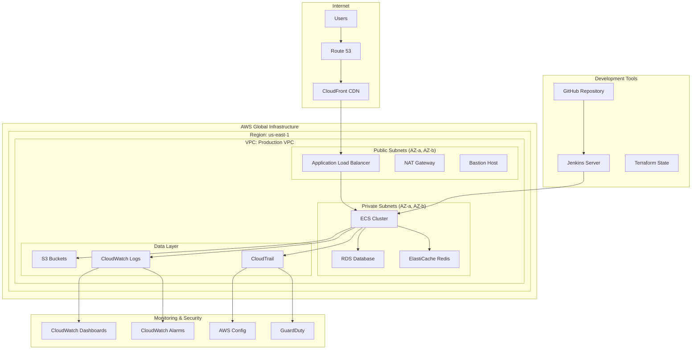

## 🔧 Detailed Component Architecture

### **Network Architecture**
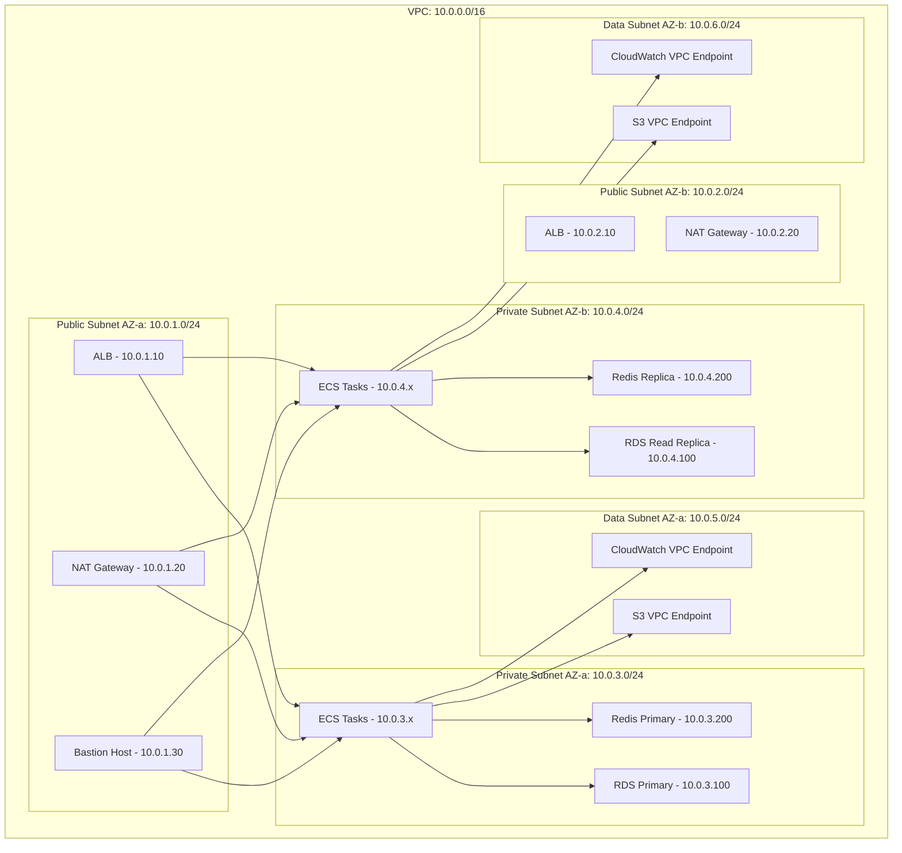

### **Application Architecture**
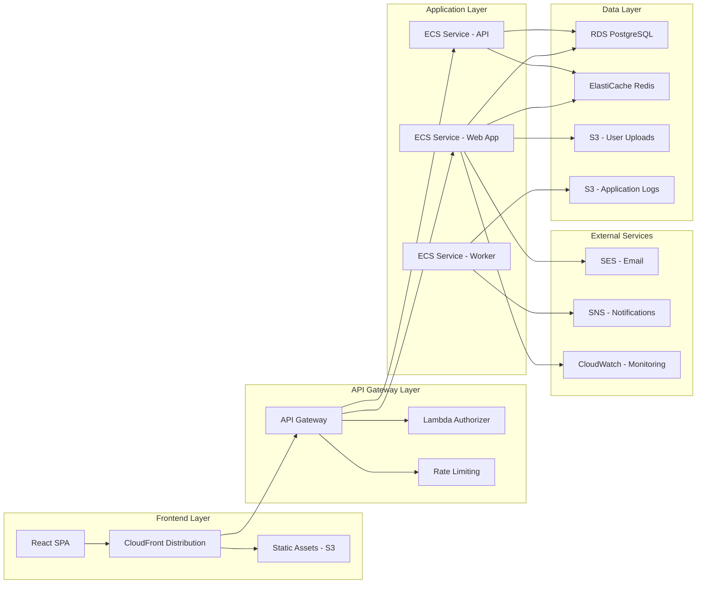

## 🚀 Deployment Architecture

### **Multi-Environment Setup**
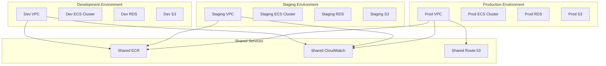

### **Container Architecture**
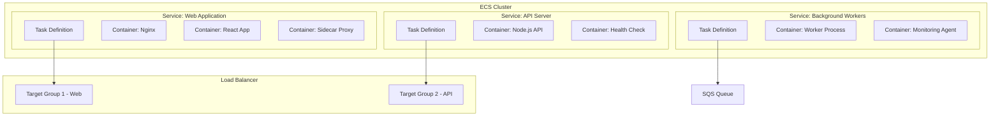

## 🔒 Security Architecture

### **Security Layers**
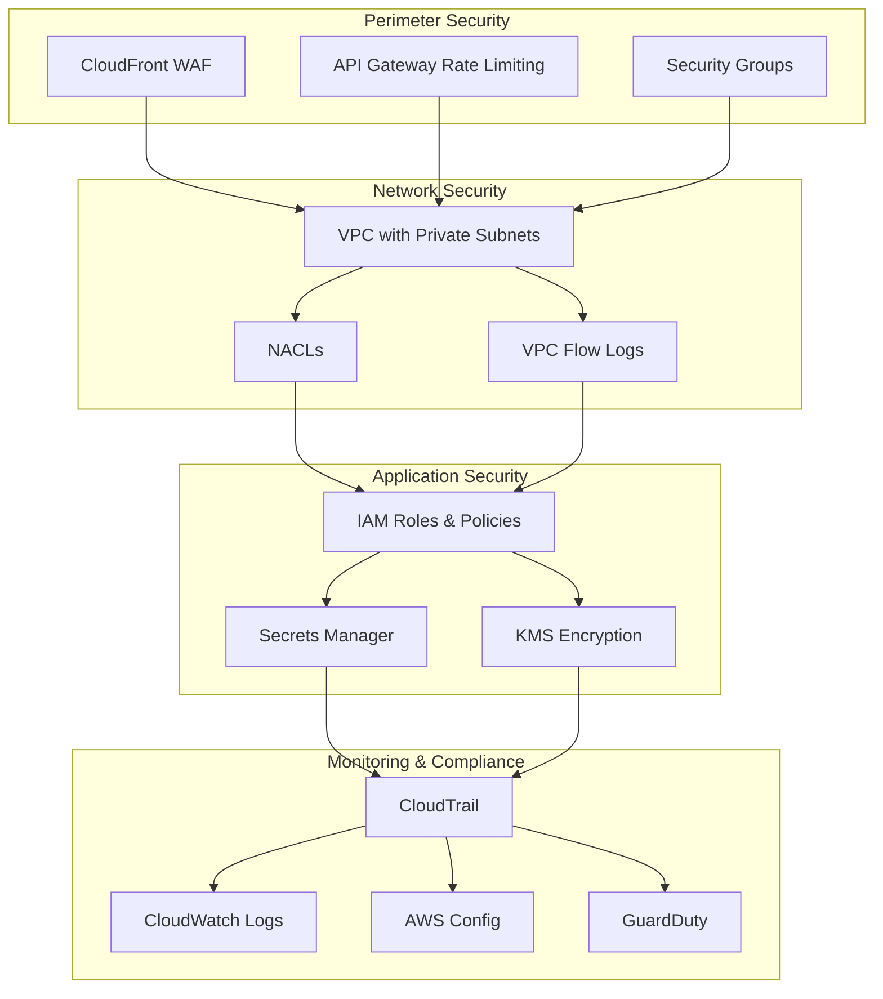

### **IAM Architecture**
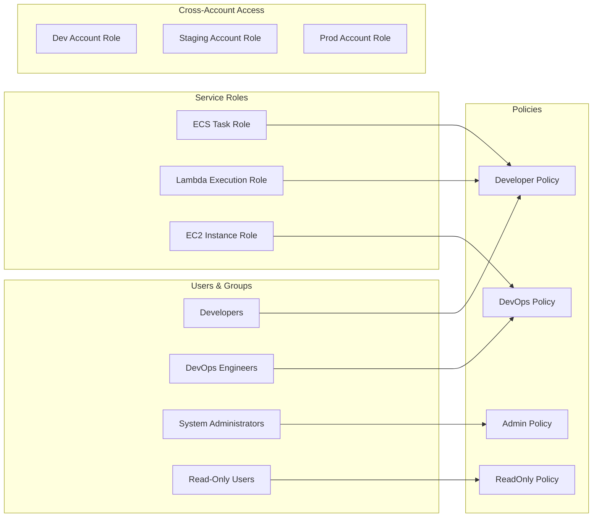

## 📊 Monitoring Architecture

### **Observability Stack**
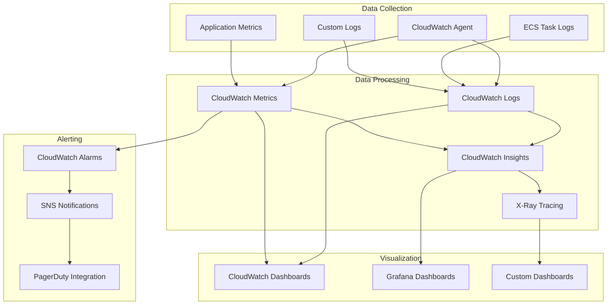

## 🔄 Data Flow Architecture

### **Request Flow**
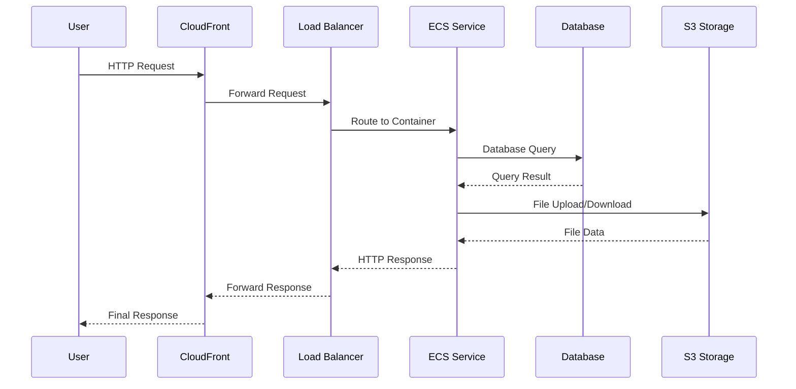

### **CI/CD Data Flow**
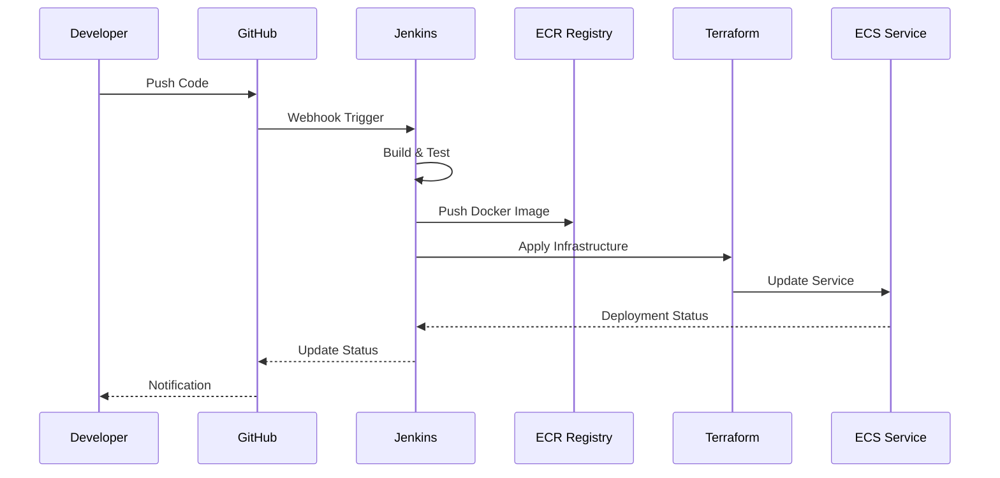

## 🎯 Performance Architecture

### **Scaling Strategy**
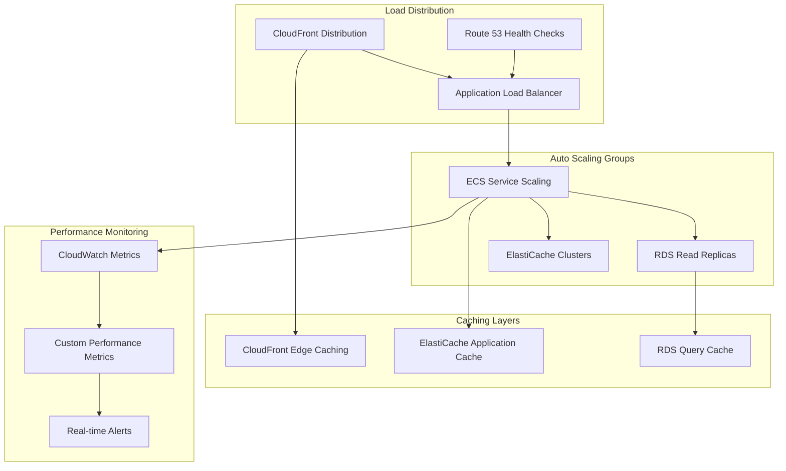

## 📋 Infrastructure Components

### **Core AWS Services Used**

| Service Category | Services | Purpose |
|------------------|----------|---------|
| **Compute** | EC2, ECS, Lambda | Application hosting and processing |
| **Storage** | S3, EBS, EFS | Data storage and file systems |
| **Database** | RDS, ElastiCache | Relational and cache databases |
| **Networking** | VPC, ALB, Route 53 | Network infrastructure and routing |
| **Security** | IAM, KMS, WAF | Identity, encryption, and protection |
| **Monitoring** | CloudWatch, CloudTrail | Observability and logging |
| **CDN** | CloudFront | Content delivery and caching |
| **CI/CD** | CodePipeline, CodeBuild | Automation and deployment |

### **Resource Allocation**

| Resource Type | Development | Staging | Production |
|---------------|-------------|---------|------------|
| **ECS Tasks** | 2 | 4 | 8-16 |
| **RDS Instances** | 1 (t3.micro) | 1 (t3.small) | 2 (t3.large) |
| **ElastiCache** | 1 node | 2 nodes | 4 nodes |
| **S3 Storage** | 10 GB | 50 GB | 500 GB+ |
| **CloudWatch** | Basic | Standard | Advanced |

---

**Note:** This architecture is designed for scalability, security, and maintainability. Adjust resource allocations and configurations based on your specific requirements and budget constraints.
